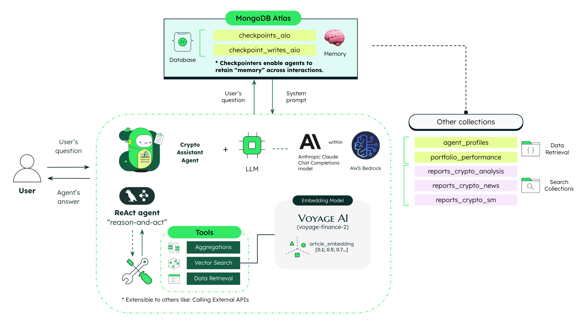
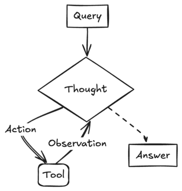

# Capital Markets - Market Assistant ReAct Agent Chatbot Service

This repository hosts the backend for the **Capital Markets - Market Assistant ReAct Agent Chatbot Service** service. The service provides insights and recommendations for capital markets using a LangGraph ReAct agent, leveraging MongoDB Atlas for data storage, vector search, and agent state management.

## High Level Architecture



## Key Features

-  **LangGraph [ReAct agent](https://langchain-ai.github.io/langgraph/concepts/agentic_concepts/#react-implementation)**: An agent built using LangGraph (a graph-based agent orchestration framework) that implements the [ReAct](https://arxiv.org/abs/2210.03629) reasoning pattern — "Reason and Act".  In simple terms: ReAct means the agent thinks step-by-step ("reasoning") and takes actions (like calling tools) as needed between thoughts. In practice, a LangGraph ReAct agent:
   1. Receives a user query,
   2. Reasons about it (e.g., “I need to look up today’s weather”),
   3. Takes an action (e.g., “call WeatherAPI tool”),
	4. Observes the result (e.g., “it’s raining”),
	5. Continues reasoning and acting until it reaches a final answer.

(The example above is a simplified version of the ReAct pattern, and below is a diagram that illustrates the ReAct pattern.)



> [!NOTE]
> The agent uses memory to store past observations and actions, which is valuable for more complex tasks. For our use case, we implement the ReAct pattern to build a **Market Assistant Agent** that analyzes market data and news articles, providing insights and recommendations to users.

-  **Long-term [memory](https://langchain-ai.github.io/langgraph/concepts/agentic_concepts/#memory)**: The agent stores and recalls information from previous interactions, building a comprehensive understanding of the user's needs and preferences. We utilize **Checkpointers** as a mechanism to store state at every step across different interactions, implemented with the [MongoDB checkpointer](https://langchain-ai.github.io/langgraph/how-tos/persistence_mongodb/) component of LangGraph.
   -  Two main collections support the checkpointer:
      -  `checkpoints_aio`
      -  `checkpoint_writes_aio` 

-  **Agent Profile**: The agent is configured with a profile that defines its role, instructions, and rules. This profile is stored in MongoDB and can be easily modified to change the agent's behavior. The agent profile is stored in the `agent_profiles` collection.  

-  **Embedding Model optimized for finance retrieval**: We use the [voyage-finance-2](https://blog.voyageai.com/2024/06/03/domain-specific-embeddings-finance-edition-voyage-finance-2/) embedding model, which is optimized for finance retrieval tasks. This model understands the nuances of financial language and generates embeddings for financial news articles, market data, and other financial documents.

-  **Vector Search**: Semantic understanding of financial market data and news articles is achieved through [MongoDB Atlas Vector Search](https://www.mongodb.com/products/platform/atlas-vector-search). This allows the agent to find semantically similar results across market and news reports. The vector search is performed on two collections:
   -  **`reports_market_analysis`** Stores market analysis reports with a vector field named `report_embedding` containing vector representations generated by the  [voyage-finance-2](https://blog.voyageai.com/2024/06/03/domain-specific-embeddings-finance-edition-voyage-finance-2/) model.
   -  **`reports_market_news`** Stores market news reports with a vector field named `report_embedding` containing vector representations generated by the  [voyage-finance-2](https://blog.voyageai.com/2024/06/03/domain-specific-embeddings-finance-edition-voyage-finance-2/) model.

### Technical Architecture
The service is built on a modular foundation using:

-  **MongoDB Atlas**: For data storage, including agent profiles, reports, and portfolio information
-  **MongoDB Atlas Vector Search**: For semantic search capabilities
-  **MongoDB checkpointer**: For agent state management
-  **VoyageAI**: For generating finance-specific embeddings
-  **AWS Bedrock/Anthropic**: For LLM inference in agent reasoning steps
-  **LangGraph**: For utilizing the [prebuilt ReAct agent](https://langchain-ai.github.io/langgraph/how-tos/create-react-agent/)
-  **FastAPI**: For reliable, documented API endpoints

## Market Assistant Agent

The **Market Assistant Agent** serves as an intelligent financial advisor that analyzes user queries, fetches relevant financial data, and presents actionable insights. Let's explore how this system works from query to response.

### Agent Flow and Interaction Model

1. **User Query Processing:**  
   When a user asks a financial question (e.g., "Based on market condition today, what overall portfolio asset reallocation would you suggest?"), the ReAct agent examines the query to determine the information need.

2. **Reasoning Step:**  
   The agent engages in a thought process, weighing which tools would be most appropriate. This reasoning is guided by the agent's profile, which defines its role, capabilities, and decision-making rules.

3. **Tool Selection:**  
   Based on its reasoning, the agent selects the most appropriate specialized tool:
   - For portfolio-specific analysis → `market_analysis_reports_vector_search_tool`
   - For news about portfolio assets → `market_news_reports_vector_search_tool`
   - For asset allocation questions → `get_portfolio_allocation_tool`
   - For year-to-date returns → `get_portfolio_ytd_return_tool`
   - For volatility metrics → `get_vix_closing_value_tool`
   - For general financial information → `tavily_search_tool`

4. **Tool Execution and Observation:**  
   The selected tool retrieves data from MongoDB collections or external APIs. The agent observes the tool's output, integrating it into its understanding.

5. **Follow-up Reasoning:**  
   If the information is incomplete, the agent may reason through additional tool calls to gather complementary data points.

6. **Response Synthesis:**  
   The agent combines all gathered information into a coherent, actionable response that directly addresses the user's query.

Throughout this process, the agent maintains a conversation state in MongoDB, enabling it to reference previous interactions and provide contextually relevant responses over time.

---

### Agent Memory Management

The Market Assistant Agent uses MongoDB as a long-term memory store to maintain context across conversation sessions:

- **Memory Storage:**  
  Two key collections—`checkpoints_aio` and `checkpoint_writes_aio`—store the complete state of agent interactions, including reasoning steps, tool calls, and observations.

- **Memory Structure:**  
  Each conversation is organized by a unique `thread_id` that includes a timestamp (format: `thread_YYYYMMDD_HHMMSS`). This allows for organized memory retrieval and management.

- **Automated Memory Cleanup:**  
  To prevent memory buildup, a scheduled job runs daily at 04:00 UTC through the `CheckpointerMemoryJobs` system:
  - **Cleanup Process:** The job identifies `thread_id`s that don't contain today's date and removes them from both memory collections. This ensures the system maintains only recent conversation history while preventing database bloat.
  - **Memory Retention Strategy:** By design, the system retains the current day's conversations, allowing users to continue discussions throughout their workday while automatically clearing older interactions that are less likely to be relevant.

This memory management approach balances the benefits of persistent conversation context with the need for database efficiency and regular maintenance.

---

### Agent Tools

The Market Assistant ReAct Agent leverages specialized tools to access and analyze financial data from various sources. These tools maintain clear boundaries between portfolio-specific analysis and general financial information.

#### Portfolio-Specific Tools

- **Market Analysis Reports Vector Search Tool**
  - **Purpose:** Retrieves relevant market insights specifically for assets in the current portfolio.
  - **Data Source:** `reports_market_analysis` collection with vector embeddings generated by the voyage-finance-2 model.
  - **Key Features:**
    - Combines vector similarity with recency scoring for optimal results.
    - Returns overall portfolio diagnosis and asset-specific insights.
    - Intelligently falls back to the most recent report if no semantic matches are found.

- **Market News Reports Vector Search Tool**
  - **Purpose:** Provides recent news summaries and sentiment analysis specifically for assets in the current portfolio.
  - **Data Source:** `reports_market_news` collection with vector embeddings.
  - **Key Features:**
    - Returns news summaries with sentiment categorization (positive/neutral/negative).
    - Includes overall news impact diagnosis for the portfolio.
    - Prioritizes the most relevant and recent news for portfolio assets.

- **Portfolio Allocation Tool**
  - **Purpose:** Shows the precise distribution of investments across different assets.
  - **Data Source:** Portfolio allocation data embedded in market analysis reports.
  - **Key Features:**
    - Returns ticker symbols, asset descriptions, and allocation percentages.
    - Provides clear visibility into current investment distribution.

- **Portfolio YTD Return Tool**
  - **Purpose:** Offers quantitative measurement of portfolio performance since the beginning of the current year.
  - **Data Source:** `portfolio_performance` collection tracking historical returns.
  - **Key Features:**
    - Calculates the difference between start-of-year and current cumulative returns.
    - Provides contextual information, including starting and ending dates.
    - Returns a formatted percentage representation of portfolio performance.

- **VIX Closing Value Tool**
  - **Purpose:** Provides insight into current market volatility levels.
  - **Data Source:** Market volatility data embedded in market analysis reports.
  - **Key Features:**
    - Extracts and formats only the essential VIX closing price.
    - Serves as a quick indicator of market sentiment and risk levels.

#### General Financial Information

- **Tavily Search Tool**
  - **Purpose:** Supplements portfolio-specific tools with broader financial data and news.
  - **Data Source:** Web search results via the Tavily API.
  - **Key Features:**
    - Returns up to 3 relevant search results with citations.
    - Used for questions about assets not in the portfolio or general market concepts.
    - Provides real-time information beyond the scope of the portfolio data.

## Where Does MongoDB Shine?

### Perfect Fit for Agentic Workflows

1. **Document Model:** MongoDB's document model stores data in JSON-like BSON format, which aligns perfectly with the agent state representation in LangGraph workflows. This enables near-seamless transitions between application objects and database storage with minimal serialization overhead.
2. **Agent Profiles Storage:** MongoDB efficiently stores and retrieves different agent profiles with distinct roles, instructions, and rules. The document model accommodates these nested, semi-structured configurations without requiring rigid schemas or complex joins.
3. **MongoDB Checkpointer for Long-Term Memory:** MongoDB Checkpointer is utilized to achieve long-term memory by storing the agent's state at every step of its interactions. This ensures that the agent can recall past observations and actions, enabling it to build a comprehensive understanding of user needs over time. The checkpointer integrates seamlessly with LangGraph workflows, providing a robust mechanism for persistence.
4. **Vector Search for Semantic Understanding:** MongoDB Atlas Vector Search enables the agent to perform semantic searches across financial data, such as market analysis and news reports. This capability ensures that the agent retrieves the most relevant and contextually accurate information for user queries.
5. **Schema Flexibility for Evolving Workflows:** MongoDB's schema flexibility allows the agent's workflows to evolve without requiring disruptive schema migrations. This adaptability is crucial for rapidly iterating on AI-driven solutions in dynamic financial markets.

## The 4 Pillars of the Document Model

1. **Easy**: [MongoDB's document model](https://www.mongodb.com/resources/basics/databases/document-databases) naturally fits with object-oriented programming, utilizing BSON documents that closely resemble JSON. This design simplifies the management of complex data structures such as user accounts, allowing developers to build features like account creation, retrieval, and updates with greater ease.

2. **Fast**: Following the principle of "Data that is accessed together should be stored together," MongoDB enhances query performance. This approach ensures that related data—like user and account information—can be quickly retrieved, optimizing the speed of operations such as account look-ups or status checks, which is crucial in services demanding real-time access to operational data.

3. **Flexible**: MongoDB's schema flexibility allows account models to evolve with changing business requirements. This adaptability lets financial services update account structures or add features without expensive and disruptive schema migrations, thus avoiding costly downtime often associated with structural changes.

4. **Versatile**: The document model in MongoDB effectively handles a wide variety of data types, such as strings, numbers, booleans, arrays, objects, and even vectors. This versatility empowers applications to manage diverse account-related data, facilitating comprehensive solutions that integrate user, account, and transactional data seamlessly.

## Tech Stack

- [MongoDB Atlas](https://www.mongodb.com/atlas/database) for database storage, vector search, and agent state management.
- [LangGraph](https://langchain-ai.github.io/langgraph/) for orchestrating multi-step agent workflows and implementing the ReAct pattern.
- [LangChain MongoDB](https://github.com/langchain-ai/langchain-mongodb) and [LangGraph Checkpoint MongoDB](https://github.com/langchain-ai/langgraph-checkpoint-mongodb) for seamless MongoDB integration and agent memory persistence.
- [VoyageAI](https://www.voyageai.com/) for domain-specific financial embeddings.
- [AWS Bedrock/Anthropic](https://aws.amazon.com/bedrock/) for LLM inference in agent reasoning steps.
- [FastAPI](https://fastapi.tiangolo.com/) for RESTful API endpoints and documentation.
- [Poetry](https://python-poetry.org/) for dependency management and packaging.
- [Uvicorn](https://www.uvicorn.org/) for ASGI server implementation.
- [Docker](https://www.docker.com/) for containerization.
- [Rich](https://rich.readthedocs.io/) for enhanced CLI output and logging.

## Relevant Python Packages

- [pymongo](https://pymongo.readthedocs.io/) for MongoDB connectivity and operations.
- [langchain-mongodb](https://github.com/langchain-ai/langchain-mongodb) for MongoDB integration with LangChain and LangGraph.
- [langgraph-checkpoint-mongodb](https://github.com/langchain-ai/langgraph-checkpoint-mongodb) for agent state persistence in MongoDB.
- [langgraph](https://github.com/langchain-ai/langgraph) for building agent workflow graphs.
- [langchain-community](https://github.com/langchain-ai/langchain) for additional agent tools and integrations.
- [boto3](https://boto3.amazonaws.com/v1/documentation/api/latest/index.html) and [botocore](https://botocore.amazonaws.com/v1/documentation/api/latest/index.html) for AWS Bedrock API integration.
- [langchain-aws](https://github.com/langchain-ai/langchain-aws) for AWS-related LangChain integrations.
- [voyageai](https://voyageai.com/) for generating finance-specific embeddings.
- [scheduler](https://pypi.org/project/scheduler/) for cleaning checkpointer collections (memories) on daily basis.
- [python-dotenv](https://pypi.org/project/python-dotenv/) for environment variable management.
- [pytz](https://pypi.org/project/pytz/) for timezone handling in scheduled reports.
- [fastapi](https://fastapi.tiangolo.com/) for API development.
- [uvicorn](https://www.uvicorn.org/) for running the ASGI server.
- [rich](https://rich.readthedocs.io/) for improved terminal output and logging.

## Relevant Models

- [voyage-finance-2](https://blog.voyageai.com/2024/06/03/domain-specific-embeddings-finance-edition-voyage-finance-2/) for generating embeddings for market and news reports.

## Prerequisites

Before you begin, ensure you have met the following requirements:

- **MongoDB Atlas** account - [Register Here](https://account.mongodb.com/account/register)
- **Python 3.10 or higher**
- **Poetry** (install via [Poetry's official documentation](https://python-poetry.org/docs/#installation))

## Setup Instructions

### Step 1: Set Up MongoDB Database and Collections

1. Log in to **MongoDB Atlas** and create a database named `agentic_capital_markets`. Ensure the name is reflected in the environment variables.
2. Create the following collections if they do not already exist:
   - `agent_profiles` (for storing agent profiles)
   - `reports_market_analysis` (for storing market analysis reports)
   - `reports_market_news` (for storing market news reports)
   - `portfolio_allocation` (for storing portfolio allocation data)
   - `portfolio_performance` (for storing portfolio performance data) 
   - `checkpoints_aio` (for storing agent state checkpoints)
   - `checkpoint_writes_aio` (for storing agent state checkpoint writes)

### Step 1b: Set Up Vector Search Index

1. Create the vector search index for the `reports_market_analysis` and `reports_market_news` collections. You can do this using the MongoDB Atlas UI or by running the following python script located in the `backend/loaders/db/` directory: `vector_search_index_creator.py`. Make sure to parametrize the script accordingly.

### Step 2: Add MongoDB User

Follow [MongoDB's guide](https://www.mongodb.com/docs/atlas/security-add-mongodb-users/) to create a user with **readWrite** access to the `agentic_capital_markets` database.

## Configure Environment Variables

> [!IMPORTANT]
> Create a `.env` file in the `/backend` directory with the following content:
>
> ```bash
> MONGODB_URI="your_mongodb_uri"
> DATABASE_NAME="agentic_capital_markets"
> APP_NAME="ist.demo.capital_markets.react.agent.chatbot"
> VOYAGE_API_KEY="your_voyage_api_key"
> TAVILY_API_KEY = "your_tavily_api_key"
> AWS_REGION="us-east-1"
> CHAT_COMPLETIONS_MODEL_ID="anthropic.claude-3-haiku-20240307-v1:0"
> EMBEDDINGS_MODEL_ID="voyage-finance-2"
> AGENT_PROFILES_COLLECTION = "agent_profiles"
> CHECKPOINTS_AIO_COLLECTION = "checkpoints_aio"
> CHECKPOINTS_WRITES_AIO_COLLECTION = "checkpoint_writes_aio"
> REPORTS_COLLECTION_MARKET_ANALYSIS = "reports_market_analysis"
> REPORT_MARKET_ANALISYS_VECTOR_INDEX_NAME = "reports_market_analysis_report_embedding_index"
> REPORTS_COLLECTION_MARKET_NEWS = "reports_market_news"
> REPORT_MARKET_NEWS_VECTOR_INDEX_NAME = "reports_market_news_report_embedding_index"
> REPORT_VECTOR_FIELD = "report_embedding"
> PORTFOLIO_PERFORMANCE_COLLECTION = "portfolio_performance"
> ```

## Running the Backend

### Virtual Environment Setup with Poetry

1. Open a terminal in the project root directory.
2. Run the following commands:
   ```bash
   make poetry_start
   make poetry_install
   ```
3. Verify that the `.venv` folder has been generated within the `/backend` directory.

### Start the Backend

To start the backend service, run:

```bash
poetry run uvicorn main:app --host 0.0.0.0 --port 8006
```

> Default port is `8006`, modify the `--port` flag if needed.

## Running with Docker

Run the following command in the root directory:

```bash
make build
```

To remove the container and image:

```bash
make clean
```

## API Documentation

You can access the API documentation by visiting the following URL:

```
http://localhost:<PORT_NUMBER>/docs
```
E.g. `http://localhost:8006/docs`

> [!NOTE]
> Make sure to replace `<PORT_NUMBER>` with the port number you are using and ensure the backend is running.

> [!TIP]
> **Run the Chatbot Directly from the Console**
>
> You can interact with the Market Assistant Agent directly from your terminal using the built-in console interface:
>
> ```bash
> # Navigate to the backend directory
> cd backend
>
> # Run the console chatbot
> poetry run python console_market_assistant.py
> ```
>
> The console interface offers several convenient features:
>
> - **Interactive Sessions**: Start new chat sessions or continue from previous conversations
> - **Conversation History**: View detailed conversation history with timestamped checkpoints
> - **Memory Management**: Clear chat memory when needed
> - **Rich Formatting**: Enjoy enhanced readability with color-coded outputs
> - **Tool Transparency**: See which specific tools the agent is using to answer your questions
>
> To navigate the console chatbot:
> - Type your financial questions naturally and press Enter
> - Type `quit` to exit the chat session
> - Type `clear all memory` and confirm with `yes` to reset all conversation history
>
> This console interface is particularly useful for testing the chatbot's capabilities or for users who prefer command-line interactions over the API endpoints.

## Common errors

> [!IMPORTANT]
> Check that you've created an `.env` file that contains the required environment variables.

## Future tasks

- [ ] Add tests
- [ ] Evaluate SonarQube for code quality
- [ ] Automate the deployment process using GitHub Actions or CodePipeline
